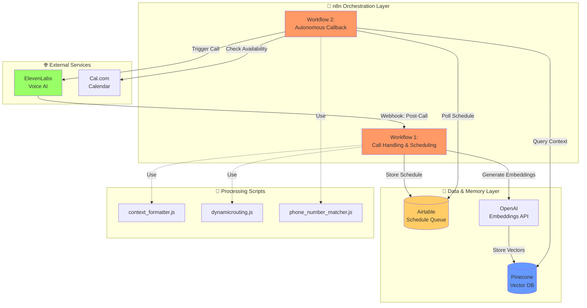
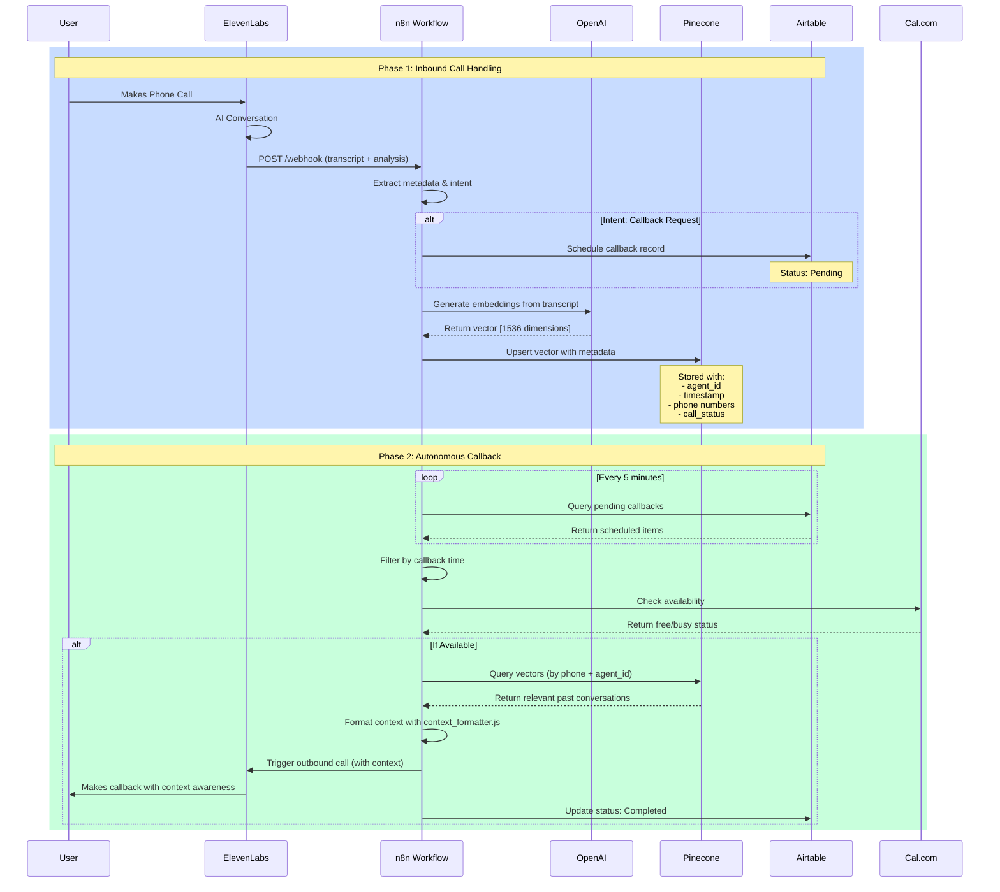
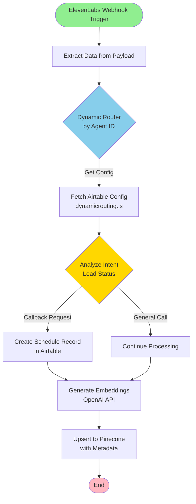
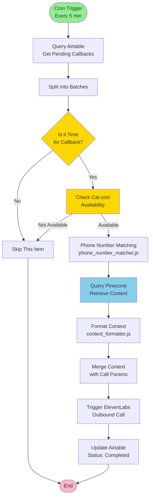
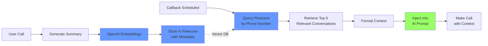

# 🤖 Autonomous AI Voice Agent & RAG Memory System

## 📋 Table of Contents
- [Overview](#-overview)
- [Key Features](#-key-features)
- [System Architecture](#️-system-architecture)
- [Workflow Details](#-workflow-details)
- [Component Deep Dive](#-component-deep-dive)
- [Data Schemas](#-data-schemas)
- [Installation & Setup](#-installation--setup)
- [Usage](#-usage)
- [Project Structure](#-project-structure)

## 🚀 Overview

This project is an **Autonomous Voice Orchestration Engine** designed to solve the "context retention" problem in AI telephony. It creates a fully autonomous AI agent that can:
- Handle inbound calls with natural conversation
- Remember past interactions using vector-based memory
- Automatically call back users at scheduled times with full context awareness
- Route calls across multiple agents with multi-tenant support

### Technology Stack
- **🎙️ ElevenLabs** - AI voice synthesis and conversational AI
- **🧠 OpenAI** - Embeddings generation and intelligence layer
- **📊 Pinecone** - Vector database for long-term memory (RAG)
- **🔄 n8n** - Workflow orchestration and automation
- **📋 Airtable** - Schedule queue and configuration management
- **📆 Cal.com** - Calendar integration for availability checking

## ✨ Key Features

### 1. Context-Aware Conversations
- **Vector Memory**: Every conversation is converted to embeddings and stored in Pinecone
- **RAG Retrieval**: Past conversations are automatically retrieved and injected into the AI context
- **Persistent Identity**: The AI "remembers" what was discussed in previous calls

### 2. Autonomous Callback System
- **Intent Detection**: Automatically identifies when users request callbacks
- **Smart Scheduling**: Queues callbacks in Airtable with metadata
- **Context Injection**: Retrieves relevant past conversations before making the callback
- **Closed-Loop Architecture**: Fully autonomous from detection to execution

### 3. Multi-Tenant Support
- **Dynamic Routing**: Agent IDs map to different Airtable bases/tables
- **Phone Number Matching**: Normalizes and matches phone numbers across configurations
- **Scalable Design**: Support multiple agents with isolated data

## 🛠️ System Architecture

### High-Level Architecture



### Detailed System Flow



## 🔄 Workflow Details

### Workflow 1: Call Handling & Scheduling

This workflow processes inbound calls and manages the initial data capture.



**Key Nodes:**
- **Webhook Trigger**: Receives POST from ElevenLabs with transcript and analysis
- **Dynamic Routing**: Uses `dynamicrouting.js` to map agent_id → Airtable base/table
- **Intent Classification**: Examines `data_collection_results.Lead_Status` field
- **Embedding Generation**: Creates 1536-dimension vectors via OpenAI
- **Vector Storage**: Stores in Pinecone with metadata for retrieval

### Workflow 2: Autonomous Callback Execution

This workflow runs on a schedule to execute callbacks with full context.



**Key Nodes:**
- **Schedule Trigger**: Runs every 5 minutes to check for pending callbacks
- **Time Filtering**: Only processes callbacks where scheduled time has arrived
- **Availability Check**: Queries Cal.com API to ensure agent is free
- **Phone Matching**: Normalizes phone numbers using `phone_number_matcher.js`
- **RAG Query**: Searches Pinecone for relevant past conversations
- **Context Formatting**: Uses `context_formatter.js` to structure memory for LLM
- **Call Execution**: Triggers ElevenLabs API with enriched context
- **Status Update**: Marks callback as completed in Airtable

## 🔧 Component Deep Dive

### Scripts

#### 1. `context_formatter.js`
**Purpose**: Formats Pinecone vector search results into LLM-compatible context strings.

**Input**: Array of Pinecone matches with metadata
```javascript
{
  matches: [
    {
      metadata: {
        summary: "User requested callback about pricing",
        timestamp: "14/11/2025 7.47pm"
      }
    }
  ]
}
```

**Output**: Formatted string for LLM injection
```
Context from previous calls:
- On 14/11/2025 7.47pm, we discussed: "User requested callback about pricing"
```

**Key Logic**:
- Handles empty results gracefully
- Escapes double quotes for JSON compatibility
- Creates chronological context list
- Formats timestamps and summaries

#### 2. `dynamicrouting.js`
**Purpose**: Multi-tenant routing logic that maps agent IDs to Airtable configurations.

**Input**: Agent ID from incoming webhook
**Output**: 
```javascript
{
  baseId: "appExampleBaseID",
  table: "Callbacks"
}
```

**Use Case**: Enables multiple AI agents to operate independently with isolated data stores.

#### 3. `phone_number_matcher.js`
**Purpose**: Normalizes and matches phone numbers across different formats.

**Input**: 
- Record with `FromNumber` field from call log
- Array of phone configurations

**Output**:
```javascript
{
  phone_number_id: "pn_12345",
  found_match_for: "+15551112222"
}
```

**Key Features**:
- Trims whitespace
- Finds matching phone configuration
- Returns phone_number_id for ElevenLabs API
- Provides clear error messages if no match found

## 📊 Data Schemas

### 1. ElevenLabs Transcript Payload
**File**: `schemas/elevenlabs_transcripts_payload.json`

Received via webhook after each call completion.

```json
{
  "type": "post_call_transcription",
  "event_timestamp": 1763120838,
  "data": {
    "agent_id": "agent_example_id_12345",
    "conversation_id": "conv_example_id_67890",
    "status": "done",
    "transcript": [
      {"role": "agent", "message": "...", "time_in_call_secs": 0},
      {"role": "user", "message": "...", "time_in_call_secs": 8}
    ],
    "analysis": {
      "data_collection_results": {
        "Lead_Status": {
          "value": "Call Back",
          "rationale": "..."
        }
      },
      "transcript_summary": "..."
    },
    "conversation_initiation_client_data": {
      "dynamic_variables": {
        "system__caller_id": "+15550000000",
        "system__called_number": "+15551112222",
        "system__call_duration_secs": 37
      }
    }
  }
}
```

**Key Fields**:
- `agent_id`: Identifies which AI agent handled the call
- `conversation_id`: Unique identifier for the conversation
- `transcript`: Full conversation history with timestamps
- `analysis.data_collection_results.Lead_Status`: Intent classification (e.g., "Call Back")
- `analysis.transcript_summary`: AI-generated summary for vector storage
- `dynamic_variables`: Call metadata (phone numbers, duration)

### 2. Pinecone Vector Metadata
**File**: `schemas/pinecone_vector_metadata.json`

Structure of vectors stored in Pinecone for RAG retrieval.

```json
{
  "vectors": [
    {
      "id": "conv_example_id_67890",
      "values": [0.0123, -0.0456, 0.789],
      "metadata": {
        "agent_id": "agent_example_id_12345",
        "timestamp": "14/11/2025 7.47pm",
        "called_number": "+15551112222",
        "calling_number": "+15550000000",
        "call_status": "Call Back",
        "conversation_id": "conv_example_id_67890",
        "config_base": "appExampleBaseID"
      }
    }
  ]
}
```

**Key Fields**:
- `id`: Uses conversation_id as vector ID
- `values`: 1536-dimension embedding from OpenAI
- `metadata.agent_id`: For filtering by agent
- `metadata.timestamp`: When the call occurred
- `metadata.calling_number`: Used for context retrieval queries
- `metadata.call_status`: Intent classification
- `metadata.config_base`: Links to Airtable configuration

### 3. Cal.com Check Payload
**File**: `schemas/calcom_check_payload.json`

Sent to Cal.com API to check agent availability.

```json
{
  "agent_id": "agent_9201k5dtnappefqben7wg6ev33dw",
  "eventTypeId": "3492202",
  "start_date": "2025-10-14",
  "end_date": "2025-10-18"
}
```

**Purpose**: Queries Cal.com for free/busy time slots before executing callback.

## 🚀 Installation & Setup

### Prerequisites
- n8n instance (self-hosted or cloud)
- ElevenLabs account with conversational AI agent configured
- OpenAI API key with access to embeddings API
- Pinecone account with vector index created
- Airtable account with base configured
- Cal.com account (optional, for availability checking)

### Environment Variables
Configure the following in your n8n credentials:

```env
# ElevenLabs
ELEVENLABS_API_KEY=your_api_key
ELEVENLABS_AGENT_ID=your_agent_id

# OpenAI
OPENAI_API_KEY=your_api_key

# Pinecone
PINECONE_API_KEY=your_api_key
PINECONE_INDEX_NAME=your_index_name
PINECONE_ENVIRONMENT=your_environment

# Airtable
AIRTABLE_API_KEY=your_api_key
AIRTABLE_BASE_ID=your_base_id

# Cal.com
CALCOM_API_KEY=your_api_key
```

### Setup Steps

1. **Import n8n Workflows**
   ```bash
   # Import the two workflow JSON files into your n8n instance
   - workflows/Call Handling & Scheduling (3).json
   - workflows/Calling back on request (5).json
   ```

2. **Configure ElevenLabs Webhook**
   - In ElevenLabs dashboard, set webhook URL to your n8n webhook endpoint
   - Enable "Post Call Transcription" events

3. **Create Pinecone Index**
   ```
   Dimension: 1536 (OpenAI text-embedding-ada-002)
   Metric: cosine
   Pod Type: p1
   ```

4. **Configure Airtable Base**
   - Create tables for: Callbacks, Agent Config, Phone Numbers
   - Set up fields matching the workflow requirements

5. **Deploy Scripts**
   - The JavaScript files in `/scripts` are embedded in the workflow
   - Update them in the n8n Code nodes if modifications needed

## 📖 Usage

### Setting Up an AI Agent

1. Configure ElevenLabs conversational AI agent
2. Add agent_id to Airtable routing configuration
3. Configure phone number mapping in Airtable
4. Set up Cal.com event type for availability

### Testing Inbound Calls

1. Call the ElevenLabs phone number
2. Have a conversation with the AI
3. Request a callback: "Can you call me back in 5 minutes?"
4. Check Airtable for scheduled callback record

### Monitoring Callbacks

1. View Airtable queue for pending callbacks
2. Check n8n execution logs for the callback workflow
3. Verify Pinecone has stored conversation vectors
4. Monitor ElevenLabs for outbound call execution

### RAG Context Retrieval

The system automatically:
- Queries Pinecone using the caller's phone number
- Retrieves top 5 most relevant past conversations
- Formats context using `context_formatter.js`
- Injects context into ElevenLabs conversation prompt

## 📁 Project Structure

```
n8npro/
├── readme.md                           # This file
├── assets/                             # (Future) Screenshots and diagrams
├── schemas/                            # JSON schema definitions
│   ├── calcom_check_payload.json       # Cal.com API request format
│   ├── elevenlabs_transcripts_payload.json  # ElevenLabs webhook payload
│   └── pinecone_vector_metadata.json   # Pinecone vector structure
├── scripts/                            # JavaScript utilities
│   ├── context_formatter.js            # RAG context string formatter
│   ├── dynamicrouting.js               # Multi-tenant agent routing
│   └── phone_number_matcher.js         # Phone number normalization
└── workflows/                          # n8n workflow definitions
    ├── Call Handling & Scheduling (3).json  # Inbound call processor
    └── Calling back on request (5).json     # Autonomous callback executor
```

## 🔍 How RAG Memory Works



**Process**:
1. **Embedding Generation**: Each call transcript is converted to a 1536-dimensional vector
2. **Metadata Storage**: Vector includes phone numbers, agent_id, timestamp, and status
3. **Semantic Search**: When callback is triggered, query Pinecone by phone number
4. **Context Ranking**: Pinecone returns most semantically similar past conversations
5. **Context Injection**: Formatted context is prepended to the AI's system prompt
6. **Context-Aware Response**: AI responds with full awareness of conversation history

## 🎯 Use Cases

- **Sales Follow-ups**: AI remembers previous discussions about products/pricing
- **Support Callbacks**: Agent recalls technical issues discussed in past calls
- **Lead Nurturing**: Maintains continuity across multiple touchpoints
- **Appointment Reminders**: References past scheduling conversations
- **Customer Service**: Provides personalized experience based on history

## 🛡️ Security Considerations

- Store API keys in n8n credentials, never in workflow JSON
- Use environment-specific Pinecone namespaces for data isolation
- Implement phone number verification before callback execution
- Set rate limits on ElevenLabs API calls
- Regularly audit Airtable permissions and access logs

## 🤝 Contributing

This is a reference implementation. Customize the workflows and scripts for your specific use case:
- Modify intent detection logic in Call Handling workflow
- Adjust RAG retrieval parameters (top_k, filters)
- Extend metadata schema for additional context
- Add error handling and retry logic
- Implement additional calendar integrations

## 📄 License

This project is provided as-is for educational and commercial use.

---

**Built with** ❤️ **using n8n, ElevenLabs, OpenAI, and Pinecone**
